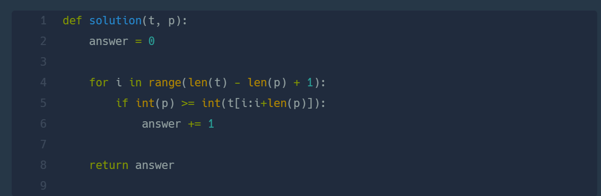
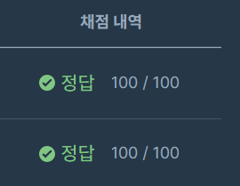

## 크기가 작은 부분 문자열  
#### lv 1  연습문제  

* 2024-02-20  
* 내가 푼 풀이  

```
def solution(t, p):
    new = []
    length = len(t) - (len(p)-1)
    count = 0 
    result = 0
    for i in range(0,length):
        new.append(t[count:count+len(p)])
        count+=1
    answer = list(map(int,new))
    for i in answer:
        if int(p) >= i:
            result+=1
    return result  
``` 

* 후기  
    * 이번 문제는 쉬운 편이었다. 문자열 슬라이싱을 통해 해결하였다.  
    * map() 함수를 처음 적용해 본 문제인 것 같다. 리스트 요소의 타입을 한번에 변환 시킬수 있어 아주 편리했다.  
    * 다른 사람 풀이    
        *  풀이 방법은 같지만 좀 더 간결하여 보기 좋았다.  
          
    
    * 이번 문제는 한번에 해결!  
      
 