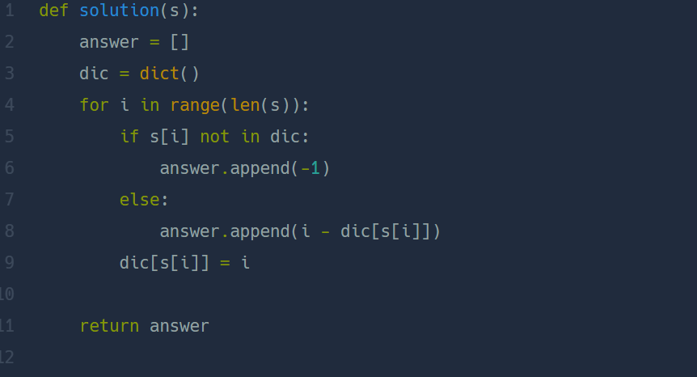

## 가장 가까운 같은 글자  
#### lv1. 연습문제  

* 2024-02-20  
* 내가 푼 풀이  
```
def solution(s):
    result = []
    for i in range(len(s)):
        if s[i] not in s[0:i]:
            result.append(-1)
        else:
            count = len(s[0:i])
            new =[]
            for j in s[0:i]:
                if s[i] == j:
                    new.append(count)
                    count-=1
                else:
                    count-=1
            result.append(min(new))
    return result
```

* 후기  
    * 문제가 쉬운 편이라 한번에 맞추었다.. count =0으로 설정하고 문자열을 뒤집어서 최근 문자의 인덱스값을 바로 result 리스트에 넣으려고 했지만 문자열 뒤집기를 실패..... count값을 수정하여 해결!  
    * ```s[0:i:-1]```으로 입력하면 슬라이싱 후 문자열이 뒤집어지지 않았다. 문자열 뒤집기 방법을 알아보았다!   
    * (방법1)```a = s[0:i]``` 이후에 ```a[::-1]```  
    * (방법2)
    ```
    a_list = list(s[0:i])
    a_list.reverse()
    b_list = "".join(a_list)
    ```

    * 다른 사람 풀이  
    
      

    * dict() -> 사전을 이용하여 풀이  
    * 사전에 해당 문자의 인덱스 값을 계속 넣어주어 해당 문자가 또 나올 경우에도 update 되도록 함. 해당 문자가 나왔을 때 가장 최근 인덱스 값을 현재 인덱스 값에서 빼준면 된다..  