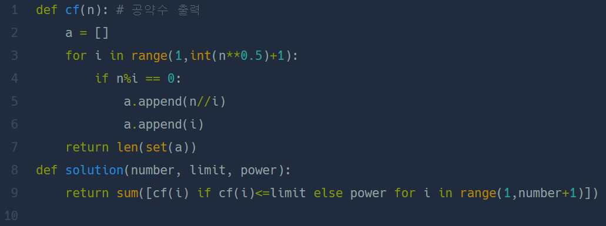

## 기사단원의 무기  
#### lv1. 연습문제  

* 2024-02-24  
* 내가 푼 풀이  

```
def solution(number, limit, power):
    answer = []
    result = 0
    for i in range(1,number+1):
        count = 0
        for j in range(1,int(i**(1/2))+1):
            if i % j == 0:
                if (j**2) != i:
                    count+=2
                else:
                    count+=1
        answer.append(count)
    for k in answer:
        if k > limit:
            result += power
        else:
            result += k
    return result
```

* 후기  
    * 처음에 풀이를 하였는데 시간초과로 실패하였다..  
    * 그래서 시간을 줄이기 위해 약수의 개수를 구하는 for문의 범위를 줄여주었다. 줄어든 범위 안에서 나머지가 0일 경우 count 값을 짝에 맞게 +2해주었다.  
    * 제곱수는 if 문으로 구별해 주어 해결했다.  

*  다른 사람 풀이  

      

    * set()함수를 이용해서 약수의 개수를 구해도 시간이 많이 줄어든다!  