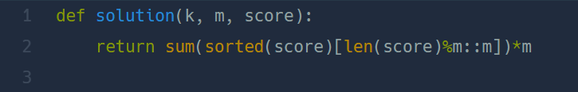

## 과일 장수  
#### lv1. 연습문제  

* 2024-02-24  
* 내가 푼 풀이  
```
def solution(k, m, score):
    score.sort(reverse=True)
    count = 0
    result = 0
    for i in range(0,len(score)//m):
        new = score[count:count+m]
        result += min(new)*m
        count+=m
    return result
```  

* 후기  
    * 쉽게 해결!  
    * score 리스트를 내림차순으로 정렬한 이후에 리스트를 m길이만큼 슬랑이싱 하여 그중 가장 작은 값을 m만큼 곱하여 result 값에 더해주어 해결하였다.  

    * 다른 사람 풀이  
          
        
        * 간단하게 한줄로 정리하여 깔끔한 코드다..  
        * score 리스트의 길이를 m으로 나눈 나머지를 시작으로 슬라이싱하여 박스를 꽉 채울 수 없는 사과를 버리고 m만큼씩 띄어서 리스트에 넣으면 최소값들만 리스트에 넣을 수 있다.  
