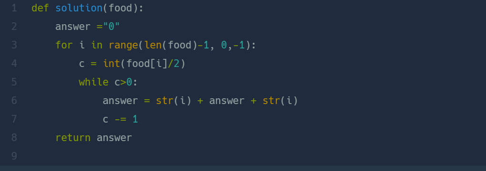

## 푸드 파이트 대회  
#### lv1. 연습문제  

* 2024-02-24  
* 내가 푼 풀이  

```
def solution(food):
    answer =""
    for i in range(1,len(food)):
        new = f"{i}"
        answer += new*(food[i]//2)
    return answer+"0"+answer[::-1]
```

* 후기  
    * 쉬운 문제여서 한번에 빠르게 풀이하였다.  
    * 음식의 갯수를 2로 나눈 몫 만큼 answer 값에 더해주었다. for문 이후에 완성된 answer 값이 0을 기준으로 문자열을 뒤집어서 더해주었다.  

* 다른 사람 풀이  
      

    * for문의 범위를 수정하여 내림차순으로 i가 출력될 수 있게 하였다. c만큼 앞뒤로 문자열로 만든 i를 더해주었다.  