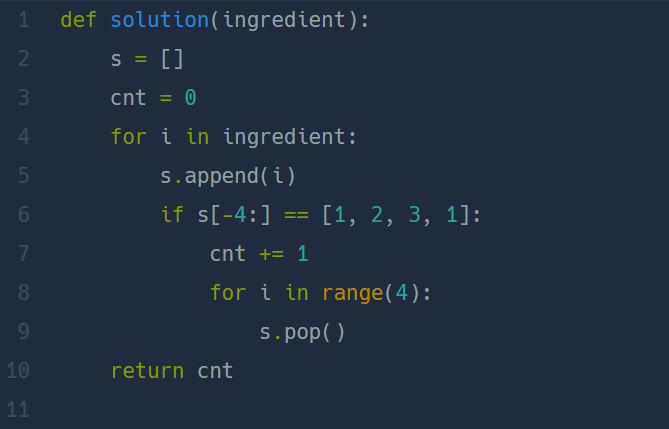

## 햄버거 만들기  
#### lv1. 연습문제  

* 2024-02-29  
* 내가 푼 풀이  

```
def solution(ingredient):
    result = 0
    new = []
    for i in ingredient:
        new.append(i)
        if new[-4:] == [1,2,3,1]:
            result+=1
            del new[-4:]
    return result
```  

* 후기  
    * 테스트케이스는 통과하였지만 시간초과로 제출에는 실패한 문제다.  
    * 이후 고민 끝에 답을 봐버린..  새로운 빈 리스트에 ingredient 값을 하나씩 추가하였다. if문을 이용해 뒤에서부터 4개의 리스트 값이 [1,2,3,1]일 경우 result값에 1을 더해주고 ```del```을 통해 해당 리스트 [1,2,3,1]을 없애주웠다.  
    * 리스트 슬라이싱을 할 경우 시간을 초과하였고 ```del```이나 ```pop```을 이용하여 수정하는 방법을 고려해야 할것이다.  
    * ```pop()``` 사용 풀이  
          

        * ```s.pop()``` : s 리스트의 마지막 요소 제거, ()안에 리스트 인덱스 값을 지정하여 제거 할 수 있다.  