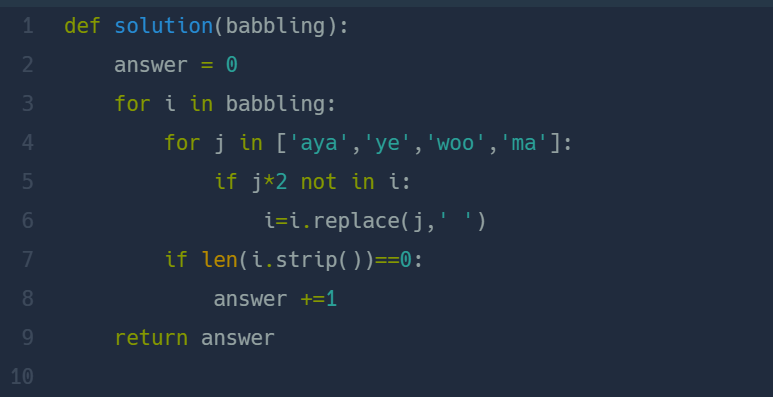

## 옹알이 (2)  
#### lv1. 연습문제  

* 2024-03-04  
* 내가 푼 풀이  

```
def solution(babbling):
    new = ["aya","ye","woo","ma"]
    new1 = ["ayaaya","yeye","woowoo","mama"]
    result = 0
    for i in babbling:
        for j in new:
            for h in new1:
                if h in i:
                    i = i.replace(h,"S")
            if j in i:
                i = i.replace(j,"A")
        if set(i) == {"A"}:
            result+=1
        print(str(set(i)))

    return result
```

* 후기  
    * 연속해서 같은 발음을 못하는 경우를 고려하는 부분 때문에 시간이 좀 걸렸다.  
    * 연속되는 발음이 들어가는 리스트 new1을 만들어 연속된 발음을 문자 "S"로 바꾸었다.  
    * 이후에는 발음할 수 있는 요소가 있다면 문자열 'A'로 바꾸었다.  
    * 문자열을 사전으로 만들어 중복요소를 제거하고 {'A'}만 남았다면 result에 +1을 해주었다.  

* 다른 사람 풀이  
      

    * if문을 사용해 연속된 발음이 없는 경우에만 발음 요소를  공백으로 바꾸었다.  
    * ```i.strip()``` : 공백을 제거하여 길이가 0일 경우 answer값에 +1 해준다.
    * 아래와 같이 ```isspace()``` 함수를 사용할 수도 있다.    
    ```
    if i.isspace():  # 공백으로 만 이루어져있을 경우 answer + 1
        answer+=1
    ```