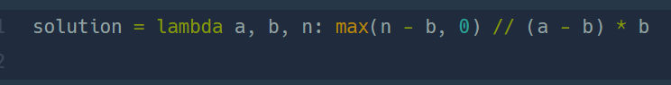

## 콜라 문제  
#### lv1. 연습문제  

* 2024-03-04  
* 내가 푼 풀이  
```
def solution(a, b, n):
    answer = n
    result = 0
    while True:
        if answer >= a:
            result = result + (answer // a)*b
            answer = answer - (answer // a) * a + (answer // a)*b
        else :
            break
    return result
```  

* 후기  
    * while 문을 통해 result값과 answer값을 갱신해주었다. 남은 병의 수가 a보다 작아지면 while문이 멈추도록 하였다.  

* 다른 사람 풀이  
      

    * ```lambda```함수를 이용하여 풀이를 하였다. 아직도 잘 이해가 안가긴 함..   


    