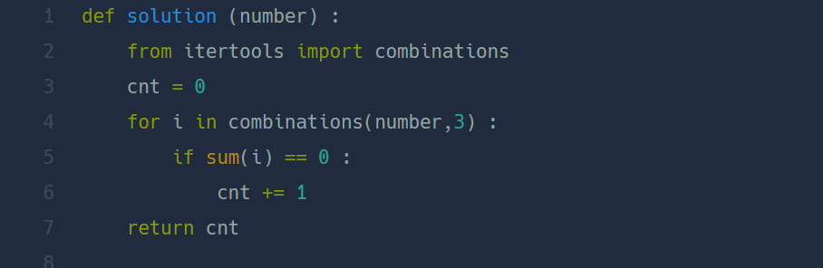

## 삼총사  
#### lv1. 연습문제  

* 2024-03-04  
* 내가 푼 풀이  
```
def solution(number):
    result = 0
    answer = 1
    for i in range(0,len(number)):
        for j in range(0,len(number)):
            for h in range(0,len(number)):
                if i != j and j != h and h != i:
                    if number[i]+number[j]+number[h] == 0:
                        result+=1
    return result // 6
```

* 후기  
    * 시간이 좀 걸렸지만 혼자 해결  
    * 삼중for문을 사용해서 number의 인덱스 값이 겹치지 않을 때 합이 0이 될때 result +1해주었다. 3가지 요소의 합이기 때문에 경우의 수가 6가지이다. 그래서 마지막에는 6으로 나누어주었다.  

* 다른 사람 풀이  
      

    * ```from itertools import combinations``` : combinations 모듈을 사용해서 리스트에서 3가지 요소를 뽑아 더하였다.  

    