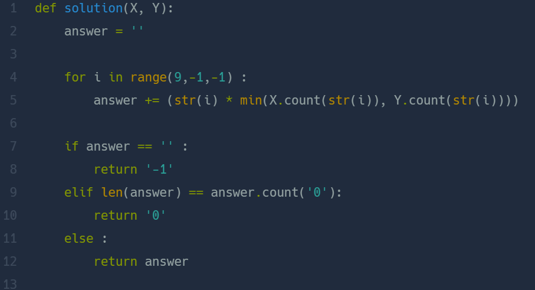

## 숫자 짝꿍  
#### Lv1. 연습문제  

* 2024-03-04  
* 내가 푼 풀이  
```
def solution(X, Y):
    answer = ""
    answer1 = ""
    for i in X:
        if i in Y:
            answer += i
    new = list(set(answer))
    for i in new:
        count = 0
        count1 = 0 
        for j in Y:
            if i == j:
                count+=1
        for h in X:
            if i == h:
                count1 += 1
        if count > count1:
            answer1+=count1*i
        else:
            answer1+=count*i
    new1 = []
    for i in answer1:
        new1.append(i)
    new1.sort(reverse=True)
    result = ''.join(new1)

    if result == "":
        return "-1"
    elif result[0] == "0":
        return "0"
    else:
        return result
```

* 후기  
    * 중복되는 값을 개수에 맞게 문자열에 추가해주는 부분에서 시간을 많이 썼다.  
    * 먼저 X,Y에 중복되는 값을 new 리스트에 추가해주었다. for문을 사용해서 x,y에 중복값이 적은 만큼 answer1에 추가해주었다. (이 부분에서 X,Y둘다 고려해주어야한다.)  
    * 문자열 answer1의 요소들을 리스트에 넣고 내림차순 정렬을 해주고 다시 문자열로!  if 문으로 값을 구분해주어 해결했다.  

* 다른 사람 풀이  
      

    * 나의 풀이와 방식은 유사하다고 생각한다. (훨씬 간단하지만...)  
    * 9부터 내림차순으로 for문을 사용함. 중복된 문자열을 count()함수를 통해 x,y중 count값이 가장 작은 값을 고려하여 answer문에 넣어준다.  