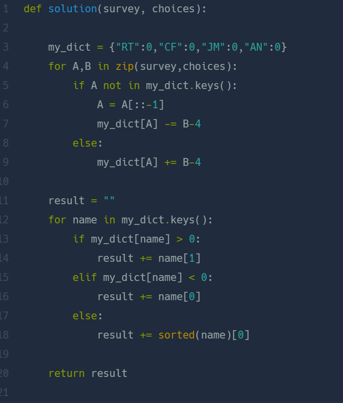

## 성격 유형 검사하기  
#### Lv1. 2022 KAKAO TECH INTERNSHIP  

* 2024-03-05  
* 내가 푼 풀이  
```
def solution(survey, choices):
    new = [0,0,0,0,0,0,0,0]
    count = 0
    result=""
    for i in survey:
        if "R" in i:
            if choices[count] > 4:
                if i[1] =="R":
                    new[0] += choices[count]-4
                else :
                    new[1] += choices[count]-4
            elif choices[count] < 4:
                if i[0] =="R":
                    new[0] += 4-choices[count]
                else :
                    new[1] += 4-choices[count]
        elif "C" in i:
            if choices[count] > 4:
                if i[1] =="C":
                    new[2] += choices[count]-4
                else :
                    new[3] += choices[count]-4
            elif choices[count] < 4:
                if i[0] =="C":
                    new[2] += 4-choices[count]
                else :
                    new[3] += 4-choices[count]
        elif "J" in i:
            if choices[count] > 4:
                if i[1] =="J":
                    new[4] += choices[count]-4
                else :
                    new[5] += choices[count]-4
            elif choices[count] < 4:
                if i[0] =="J":
                    new[4] += 4-choices[count]
                else :
                    new[5] += 4-choices[count]
        elif "A" in i:
            if choices[count] > 4:
                if i[1] =="A":
                    new[6] += choices[count]-4
                else :
                    new[7] += choices[count]-4
            elif choices[count] < 4:
                if i[0] =="A":
                    new[6] += 4-choices[count]
                else :
                    new[7] += 4-choices[count]
        count+=1
    base = ["R","T","C","F","J","M","A","N"]
    for i in range(0,len(new),2):
        if new[i] >= new[i+1]:
            result += base[i]
        else:
            result += base[i+1]
    return result
```  

* 후기  
    * 카카오 인턴쉽 문제라 겁 먹었지만, 한번에 통과했다! 코드의 길이가 길고 깨끗하지 않지만 만족한다.  
    * new라는 새로운 리스트를 만들고 초기값을 0으로 주었다. survey리스트를 for문 돌려서 만약 특정 문자를 포함한다면 그 순서에 맞게 new리스트에 점수를 choices리스트에 맞게 더해주었다.  
    * for문이후에는 new리스트를 고려하여 result문자열에 문자를 하나씩 넣어주었다.  

* 다른 사람 풀이  
    *   

    * ```zip()```: for문에 survey와 choices 리스트를 동시에 실행시킨다.  
    * my_dict에 키값에 들어가있는지에 대한 유무에 따라 value값을 더해준다.  
    * 이후엔 value값에 따라 result에 문자열을 추가해주었다. 사전을 이용한 간단한 풀이였다.  
    