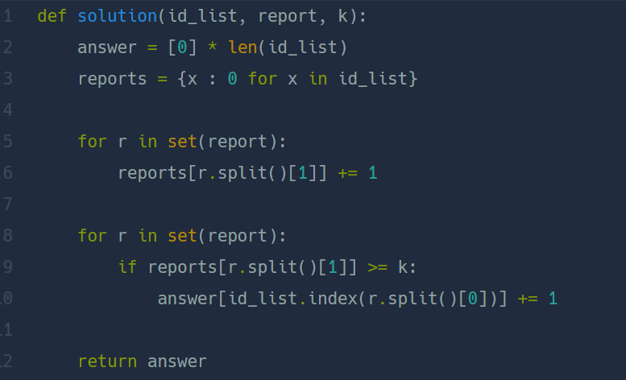

## 신고 결과 받기  
#### lv1. 2022 KAKAO BLIND RECRUITMENT  

* 2024-03-06  
* 내가 푼 풀이  
```
def solution(id_list, report, k):
    id_dict = {}
    for i in id_list:
        id_dict[i] = 0
    
    report = list(set(report))
    for i in report:
        new = i.split(" ")
        id_dict[new[1]] += 1
        
    answer = []
    for i in id_dict:
        if id_dict[i] >= k:
            answer.append(i)
            
    result_dict={}
    for i in id_list:
        result_dict[i] = 0
    
    for i in report:
        new = i.split(" ")
        if new[1] in answer:
            result_dict[new[0]]+=1
                
    result = []
    for i in result_dict:
        result.append(result_dict[i])
        
    return result
```   

* 후기  
    * 첫 시도는 시간초과로 통과하지 못했지만 이중 for문을 지우고나니 통과할 수 있었다!  
    * 사전을 이용하여 신고받은 횟수를 체크해주고 그 횟수가 k 이상일 경우 answer 리스트에 명단을 받았다.  
    * 이후 새로운 사전을 만들어 answer리스트에 포함된 이름을 신고한 사람의 value값에 1씩 더해주었다. 마지막으로 result리스트를 만들어 키값들을 반영시켰다.  

* 다른 사람 풀이  
      

    * 내 방식과 별반 다르진 않지만 간단한 풀이이다.
    나와 동일하게 반복되는 신고는 ```set()```함수를 통해 제거하였다. 
    ```리스트.index()```로 answer리스트의 값을 바꿔줬는데 이 방법은 시간이 오래 걸릴 수 있다.  
    * 첫 번째 for문에서 신고받은 횟수를 사전에 받아 준다. 두번째 for문에서 신고 받은 횟수가 k번 이상이면 신고한 사람의 index값을 id_list에서 받아와 answer리스트에 받영해주었다.  