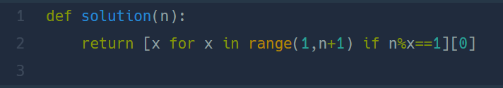

## 나머지가 1이 되는 수 찾기  
#### Lv1. 월간 코드 챌린지 시즌 3  

* 2024-03-07  
* 내가 푼 풀이  
```
def solution(n):
    for i in range(1,n):
        if n % i == 1:
            return i
```

* 후기  
    * 쉽게 해결한 문제이다. n을 1부터 n-1까지의 숫자들로 나누었을 때 처음으로 나머지가 1이 되는 경우  그 해당 숫자를 리턴해주니 해결되었다.  
    
* 다른 사람 풀이  
      

    * 나와 비슷한 풀이이다. 이 방법은 리스트에 나머지가 1이되는 숫자를 모두 넣고 가장 첫번째 요소를 리턴하였다.  
    * 시간 측면에서는 내 풀이가 더 나은 것 같다.( 더 빠른 풀이가 뭔진 모르겠다...)   


    