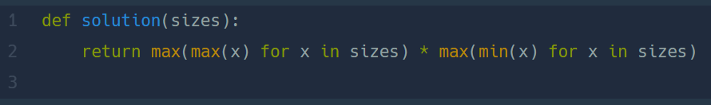

## 최소직사각형  
#### Lv1. 완전탐색  

* 20204-03-07  
* 내가 푼 풀이  
```
def solution(sizes):
    w = 0
    h = 0
    for i in sizes:
        if i[0] < i[1]:
            size = i[0]
            i[0] = i[1]
            i[1] = size
        if i[0]>w:
            w = i[0]
        if i[1] > h :
            h = i[1]
    return w * h
```

* 후기  
    * 어렵지않게 해결했다. 가로와 세로의 구분없이 명함의 가장 긴 부분을 첫번째 인덱스로 옮기고 첫번째 인덱스에서 가장 큰 길와 두번째 인덱스에서 가장 큰 길이를 찾아 곱해주었다.  

* 다른 사람 풀이  
      

    * ```max()```와 ```min()```을 적절히 사용한 간단한 풀이이다. 내가 푼 풀이와 로직은 비슷하다.  

    
