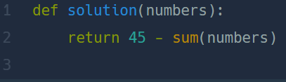

## 없는 숫자 더하기  
#### Lv1. 월간 코드 챌린지 시즌 3  

* 2024-03-07  
* 내가 푼 풀이  
```
def solution(numbers):
    result = 45
    for i in numbers:
        result -= i
    return result
```  

* 후기   
    * 문제없이 쉽게 해결했다. 1부터 9까지의 총합이 45인 것을 이용하여 numbers리스트에 있는 값을 다 빼주고 리턴하였다.  

* 다른 사람 풀이  
      

    * 아차차...! ```sum()```함수를 까먹고 있었다. 담에는 나도 활용해봐야갰다.  

    