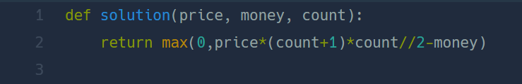

## 부족한 금액 계산하기  
#### Lv1. 위클리 챌린지  

* 2024-03-07  
* 내가 푼 풀이  
```
def solution(price, money, count):
    result = 0
    for i in range(1,count+1):
        result += price * i
    if result < money:
        return 0
    else :
        return result - money
```

* 후기  
    * 쉽게 문제를 해결했다. count값으로 범위를 지정하여 i값에 따라 result에 값을 더해주었다. result 가 money 보다 작을 경우엔 0으로 리턴하고 나머지 경우엔 result와 money의 차이를 리턴해주었다.  

* 다른 사람 풀이  
      

    * 등차수열의 합 공식을 이용한 풀이이다. ```max()```함수로 0 이하가 되었을 경우를 처리했다. 기억해놔야겠다.  

    