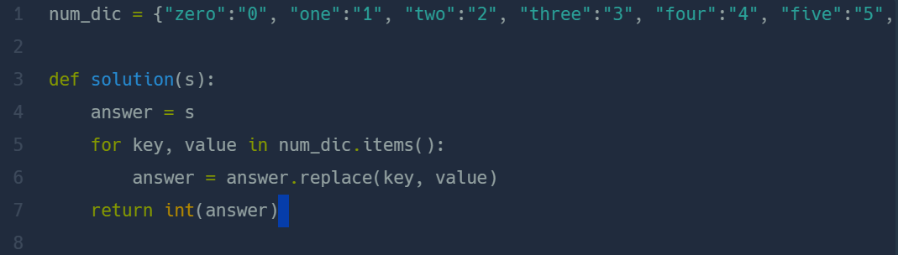

## 숫자 문자열과 영단어   
#### 2021 카카오 채용연계형 인턴쉽  

* 2024-03-07  
* 내가 푼 풀이  
```
def solution(s):
    if "zero" in s:
        s = s.replace("zero","0")
    if "one" in s:
        s = s.replace("one","1")
    if "two" in s:
        s = s.replace("two","2")
    if "three" in s:
        s = s.replace("three","3")
    if "four" in s:
        s = s.replace("four","4")
    if "five" in s:
        s = s.replace("five","5")
    if "six" in s:
        s = s.replace("six","6")
    if "seven" in s:
        s = s.replace("seven","7")
    if "eight" in s:
        s = s.replace("eight","8")
    if "nine" in s:
        s = s.replace("nine","9")
    return int(s)
```

* 후기      
    * 쉽게 해결했다. 더욱 간단한 풀이가 떠오르지 않아 노가다로 풀었다. 문자열을 제거하거나 바꾸어줄때는 ```replace()```함수를 사용하면 된다.  

* 다른 사람 풀이  
      

    * 사전을 이용한 간단한 풀이였다. 사전의 key값과 value값을 동시에 돌려주었다.  