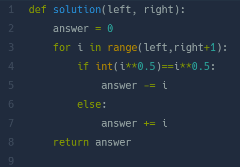

## 약수의 개수와 덧셈  
#### Lv1. 월간 코드 챌린지 시즌 2  

* 2024-03-07  
* 내가 푼 풀이  
```
def solution(left, right):
    result = 0
    for i in range(left,right+1):
        count = 0
        for j in range(1,int((i)**(1/2))+1):
            if i % j == 0 :
                if int(j ** 2) == i:
                    count +=1 
                else:
                    count += 2
        if count % 2 == 0:
            result += i 
        else:
            result -= i
    return result
```  

* 후기  
    * 쉽게 해결하였다. 약수의 개수를 찾는 과정에서 해당 값의 제곱근까지로 범위를 좁혀 for문을 실행하였다. 약수는 짝을 가지고 있기 때문에 그 점을 이용하였다. 제곱근일 경우를 제외하고는 count값에 +2를 해주었다.(j가 제곱근일 경우엔 +1, 16일때 약수가 4일 경우와 같음) 이후엔 약수의 개수가 짝수이면 result값에 더해주고 홀수일 경우엔 빼주었다.  

* 다른 사람 풀이  
      

    * 제곱근이 약수일 경우 약수의 개수가 홀수인 걸 인지를 못했다.. 아쉽다 젠장!  

    