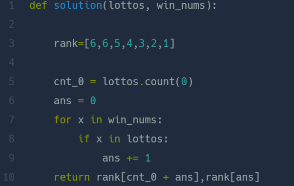

## 로또의 최고 순위와 최저 순위  
#### Lv1. 2021 Dev-Matching: 웹 백엔드 개발자(상반기)  

* 2024-03-07  
* 내가 푼 풀이  
```
def solution(lottos, win_nums):
    my_dict={6:1,5:2,4:3,3:4,2:5,1:6,0:6}
    count = 0
    maxi = 0
    for i in lottos:
        if i in win_nums:
            count+=1
    maxi = lottos.count(0) + count
    return [my_dict[maxi],my_dict[count]]
```  

* 후기  
    * 쉽게 풀이하였다. 사전을 사용해서 맞춘 번호 갯수에 따라 value값으로 순위를 넣어주었다. 가장 높은 순위일 경우는 맞힌 번호의 개수와 lottos에 들어가있는 0의 개수이고 가장 낮은 순위는 맞힌 번호의 개수이다.  

* 다른 사람 풀이  
      

    * 사전의 키값이 아닌 리스트의 인덱스 값을 이용한 풀이이다. 로직은 나의 풀이와 같다.  

    