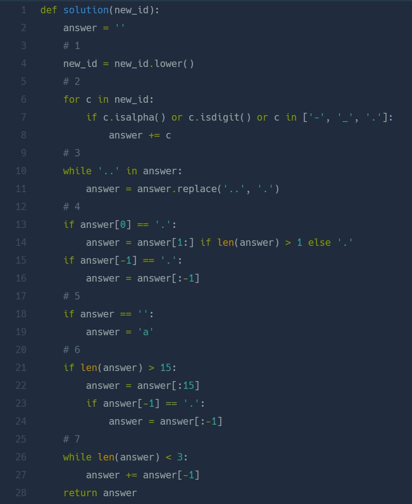

## 신규 아이디 추천  
#### Lv1. 2021 KAKAO BLIND RECRUITMENT  

* 2024-03-11   
* 내가 푼 풀이    
```
def solution(new_id):
    result = new_id.lower()     #1
    answer = ["-","_","."]
    for i in result:
        if i.isalnum() == True or i in answer:
            continue
        else:
            result = result.replace(i,"")       #2
    while True:
        new= []
        for i in range(0,len(result)):
            if result[i] == ".":
                new.append(int(i))
        for i in range(0,len(new)-1):
            if new[i] +1 == new[i+1]:
                new[i] = 99
        base = 0
        for i in range(0,len(new)):
            if new[i] == 99:
                base +=1
                if new[i+1] != 99:
                    result = result.replace(result[new[i+1]-base:new[i+1]+1],".")
                    break
        if 99 not in new:
            break               #3
    new1=[]
    for i in result:
        new1.append(i)
    
    if new1 != []:    
        if new1[0] == ".":
            new1.pop(0)
    if len(new1)>=16:
        new1 = new1[0:15]
    if new1 != []: 
        if new1[-1] == ".":
            new1.pop(-1)
    if new1 == []:
        new1.append("a")
        
    while True:
        if len(new1) <=2:
            new1.append(new1[-1])
        else:
            break
    result = "".join(new1)
    return result
```   

* 후기      
    * 처음 풀이에서 한 케이스가 실패하여 통과하지 못했다. #3에서 중복된 "." 값을 제거하는데 범위를 잘못 설정했었다. #3 코드를 완성하는데 시간이 많이 소요 되었다.  
    * ```문자열.lower()```: 문자열로 소문자로 바꿀 수 있다. <br>```문자열.upper()``` : 문자열을 대문자로 바꿀 수 있다.  
    * ```문자열.isalnum()``` : 문자열이 숫자 혹은 문자인지 판단해준다.<br> ```문자열.isalpha()```: 문자열이 문자인지 판단한다. <br>```문자열.isdigit()```: 문자열이 숫자인지 판단한다.  
    * #3은 연속된 "."의 중복을 제거하는 코드이다. new라는 새로운 리스트에 문자열이 "."일 경우 해당 인덱스 값을 담았다. 연속된 숫자가 담겼다면 "."이 연속된 것이므로 해당 인덱스 값을 99로 바꾸어주었다. 연속으로 있던 "."의 마지막 인덱스 값 전 까지 99로 바뀌게 되고 이를 이용해 리스트 슬라이싱을 해주었다.   

* 다른 사람 풀이    
      

    * #3의 풀이를 아주 간단히 하였다. 문자열에 ".."이 포함되어 있는 동안 ".."을 "."으로 대체하였다. 나머지는 비슷하다.  


    