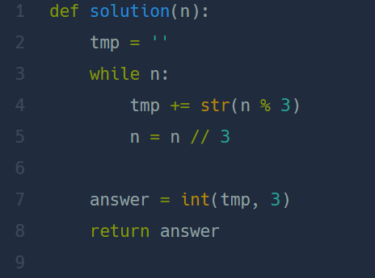

## 3진법 뒤집기  
#### lv1. 월간 코드 챌린지 시즌1  

* 2024-03-12  
* 내가 푼 풀이  
```
def solution(n):
    count = 0
    new = []
    result = 0
    while True:
        if 3 ** count > n:
            break
        else:
            count+=1
    count1 = count-1
    count2 = 0
    count3 = 0
    for i in range(0,count):
        while True:
            if (3 ** count1) *count2> n:
                result += (3**count3)*(count2-1)
                n = n - (3 **(count1)) *(count2-1)
                count1 -=1
                count2 = 0
                count3 +=1
                break   
            else:
                count2+=1
    return result
```

* 후기  
    * 3진법 문제를 오랜만에 접해 풀이하는데 시간이 걸렸다. 그래도 한번에 통과하였다.  
    * 첫 while문을 통해서 3진법의 자릿수를 정하였다. count값을을 이용하여 자릿수마다 다시 while문을 반복해주었다. 너무 복잡하게 풀었다.  
* 다른 사람 풀이  
      

    * 먼저 while문의 3진법 변환 방법을 기억해야겠다.
    * ```int(문자열,진법)```: int()함수를 이용하여 해당 진법의 문자열을 10진법으로 바꾸어 줄 수 있다.  
    
       
