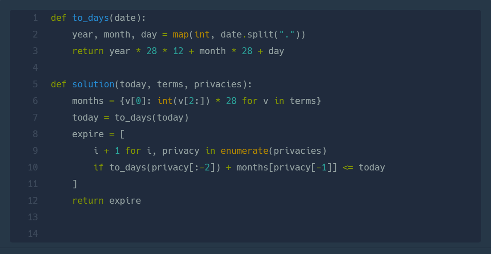
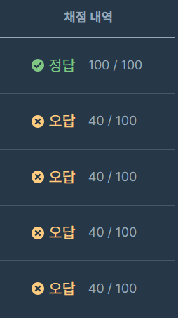

## 개인 정보 수집 유효기간  
#### 2023 KAKAO BLIND RECRUITMENT  

* 2024-02-19  
* 내가 푼 풀이  
 ```
def solution(today, terms, privacies):
    result = []
    terms_new = {}
    count = 1
    today_date = today.split(".")
    for k in range(0,len(today_date)):
        today_date[k] = int(today_date[k])
    print(today_date)
    for j in terms:
        new = j.split(" ")
        terms_new[new[0]]=int(new[1])
    for i in privacies:
        privacies_new = i.split(" ")
        month = terms_new[privacies_new[1]]
        date_list = privacies_new[0].split(".")
        for q in range(0,len(date_list)):
            date_list[q] = int(date_list[q])
        date_list[0] += month // 12
        date_list[1] += month % 12
        date_list[2] = date_list[2] - 1
        if date_list[2] == 0 :
            date_list[1] = date_list[1]-1
            date_list[2] += 28
        if date_list[1] > 12:
            date_list[0] = date_list[0]+1
            date_list[1] -= 12
        print(date_list)
        if date_list[0] < today_date[0]:
            result.append(count)
        elif date_list[0] == today_date[0]:
            if date_list[1] < today_date[1]:
                result.append(count)
            elif date_list[1] == today_date[1]:
                if date_list[2] < today_date[2]:
                    result.append(count)
        count+=1
    return result
 ```

 * 후기  
    * 너무 코드가 길다.
    * map()함수와 enumerate()함수를 사용한 풀이를 보고 참고해보자  
        
    * 코드 예제가 다 맞았지만 오류가 발생.. 테스트 케이스를 생각해보고 제출해보자  
      알고보니 12달 초과로 유효기간이 주어질 경우를 고려하지 않았닷!!  
        
