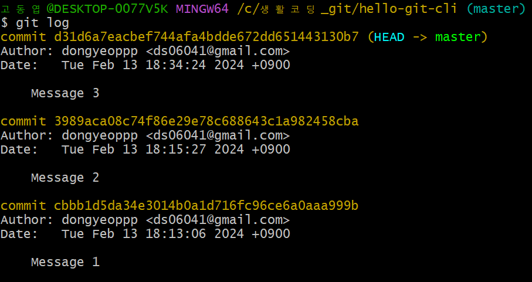
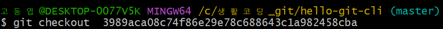
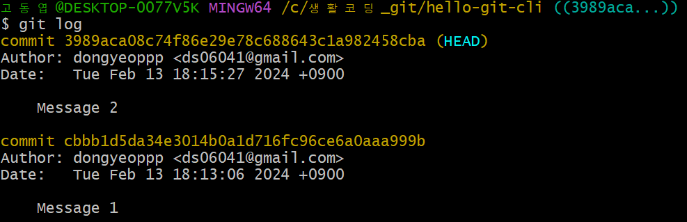
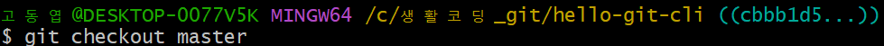
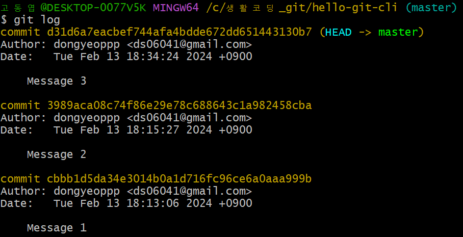
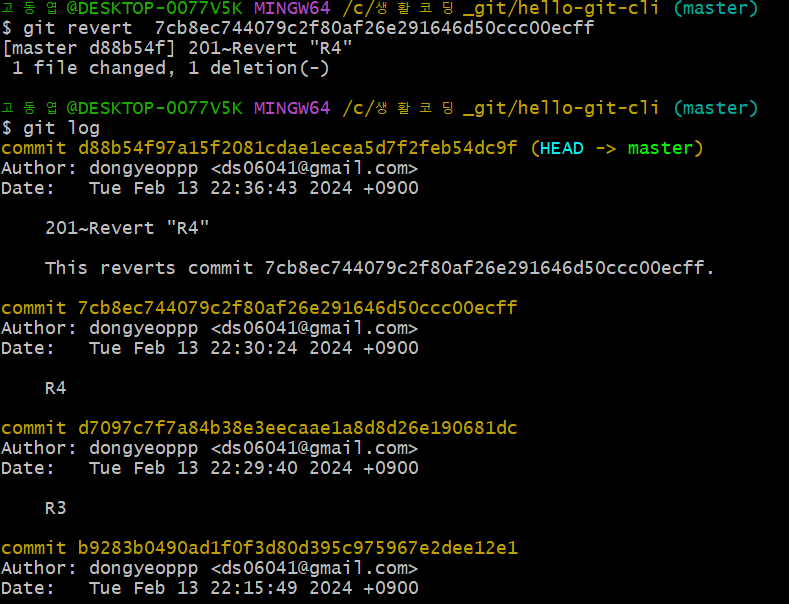
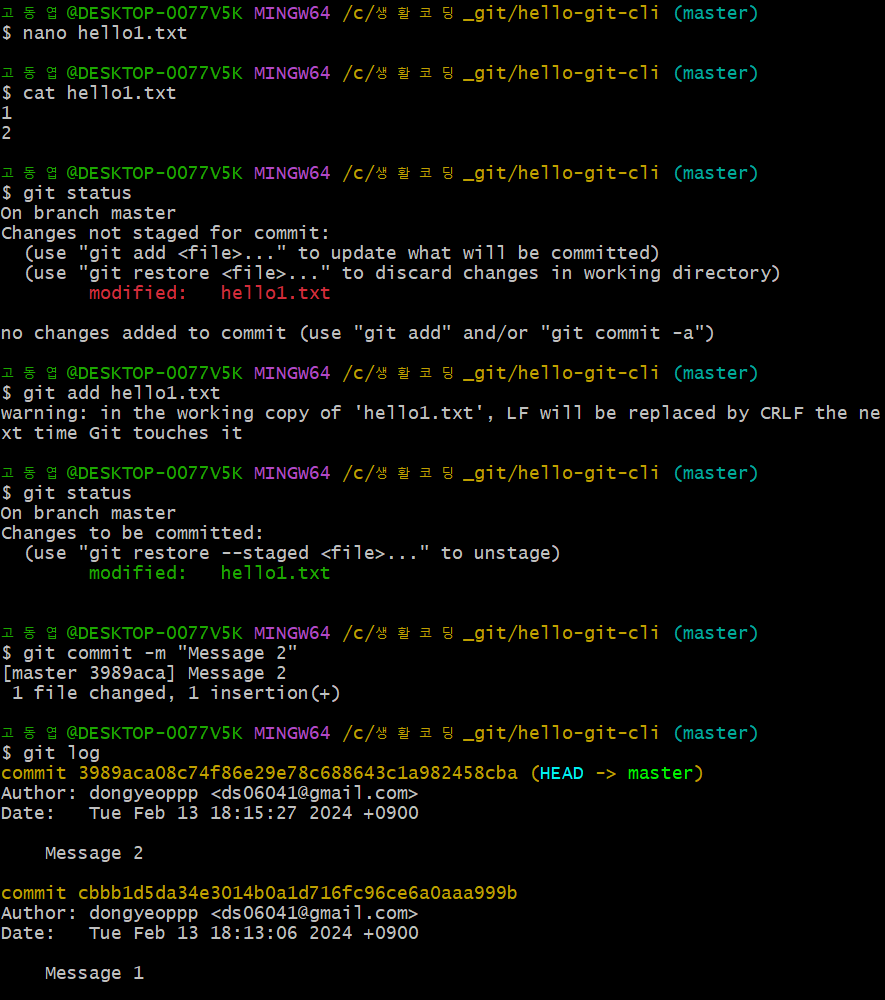

## GIT_1

* git의 목적  
    * 버전 관리  
    * 백업  
    * 협업  

## Git CLI - 버전 관리  
* 버전 만들기  
    * ```git init```: Initialize respository  
    * ```.git``` : git repository  
    * ```git status``` : working tree status  (git의 상태 출력)
    * ```git add``` : add to staging area  (버전이 될 파일을 추가)  
        * ```git add .``` -> 현재 디렉토리 아래 모든 파일을 add함  
    * ```git commit``` : create version  (버전으로 만들기)  
        * ```git commit -am "커밋메세지"``` -> am(add와 commit을 동시에 실행하지만, add가 한번도되지 않은 파일엔 적용되지 않음)
    * ```git log``` : show version  
    * ```git log --stat``` : 각각의 버전 별로 어떤 파일이 있는지 확인함  
    * ```git diff``` : show changes  (파일의 이전 작업과 함께 수정된 내용을 확인할 수 있음)
    * ```git reset --hard``` : 이전에 작업했던 내용으로 되돌아 감  
    * ```git log -p``` : 이전에 작업했던 전체 내용을 확인할 수 있음  
    (문서상에서 어디에 문제가 생겼는지 추적하는데 도움을 줌)
    * ```git checkout``` : "checkout (commit id)"를 통해 이전에 작업한 내용의 원하는 곳으로 이동이 가능 (시간여행)  
        * ```git log```를 통해 commit id 확인  
        
        * ```git checkout``` 사용  
          
        * checkout이후 git log  
          
        * ```git checkout master```(가장 최신이었던 상태로 돌아감)  
          
        * ```git log```를 통해 다시 원상복구 됨을 확인  
          
    * ```git reset --hard``` : 해당 commit id버전으로 감  
    * ```git revert "commit id"```: 해당 commit id 이전의 작업으로 돌아감(해당 commit 버전은 삭제하지 않으면서 되돌리기)  
    반드시 역순으로 revert 해야함, 건너뛰기하면 충돌 발생    
        * git revert 이후  
          

* 버전  만드는 과정  
      
    *  nano "파일이름" -> 통해 파일 내용 수정하기  
    *  cat "파일이름" -> 통해 파일 내용 보기  
* git 복사, 붙여넣기  
    * 복사 : shift + alt + (fn)  
    * 붙여넣기 : shift + insert + (fn)


