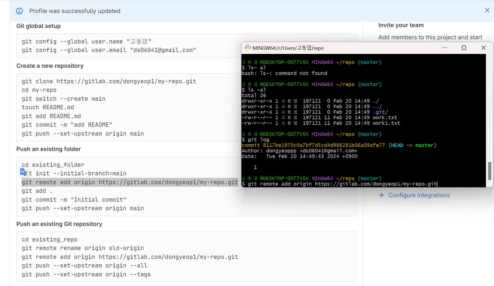
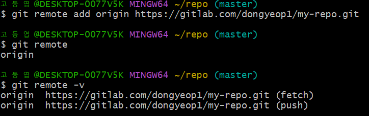
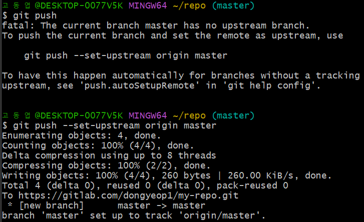
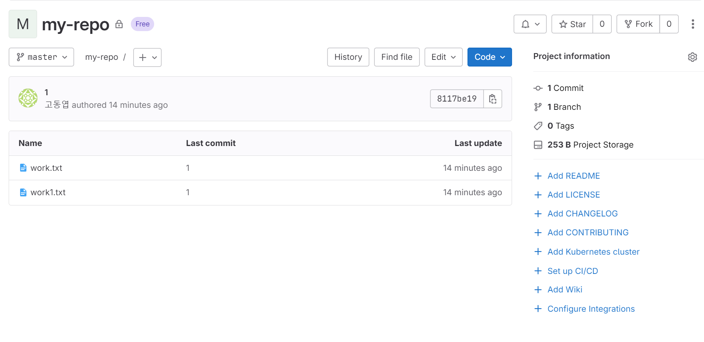
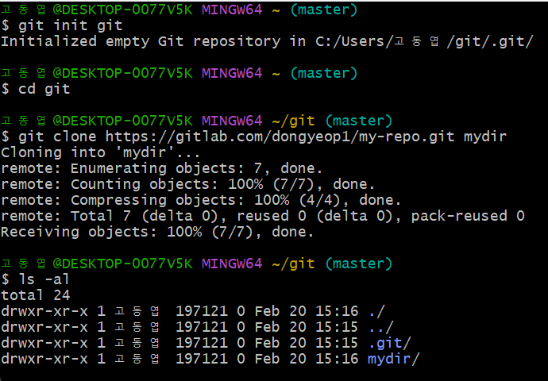
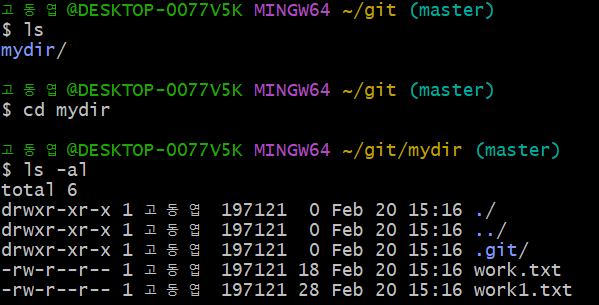

## GIT CLI - Backup  

* git 원격 저장소와 연결  
    * gitlab으로 실습 진행  
    * new project를 통해 새로운 저장소 생성  
    * http 주소를 사용해서 원격 저장소 연결(origin -> 기본적인 원격저장소의 별명) 
      

    * ```git remote``` : 원격 저장소 확인  
    * ```git remote -v``` : 원격 저장소의 주소 확인  

      

* 원격 저장소에 파일 올리기(push)
    * ```git push```  를 처음 사용할 경우 아래와 같은 결과 발생  
      

    *  ```git push --set-upstream origin master```: origin의 master가 가르키는 저장소에 기본적으로 push한다는 명령어  
    * 위의 코드를 복사하여 입력 -> gitlab의 인증메시지가 자동으로 나와서 인증해주면 업로드 완료 ~!  
    * 파일이 잘 업로드 됨  
      

* ```git cloen``` : 복제  
    * 원격저장소에서 복제해서 지역저장소를 만들기  
    * ```git init git ``` : 'git'이라는 새로운 디렉토리 생성  
    * ``` cd git ``` : git 디렉토리로 이동  
    * ``` git clone https://gitlab.com/dongyeop1/my-repo.git mydir``` : my-repo(이전에 만든 디렉토리)디렉토리 복제하여 가져옴  
        * http주소 뒤에 새로운 이름을 지정하면 디렉토리 이름 변경 가능(아무것도 붙이지 않으면 my-repo가 그대로 사용됨, 여기서는 mydir로 변경함)
        * ```ls -al``` : 해당 파일에 대한 정보 표시  
          
    * mydir디렉토리 안에 my-repo(이전에 만든 디렉토리)안에 파일이 그대로 들어온것을 확인할 수 있음!  
      

* ```git pull ``` -> 작업 -> 커밋 -> ```git push```  순서로 진행하자  
* git을 이용해 원격저장소인 git hub(or gitlab)에 push하여 내가 쓴 코드나 파일을 올릴 수 있음을 배웠다. 이후에는 issues의 사용이나 Pull requests의 사용에 대해 알아가보자~!!   
