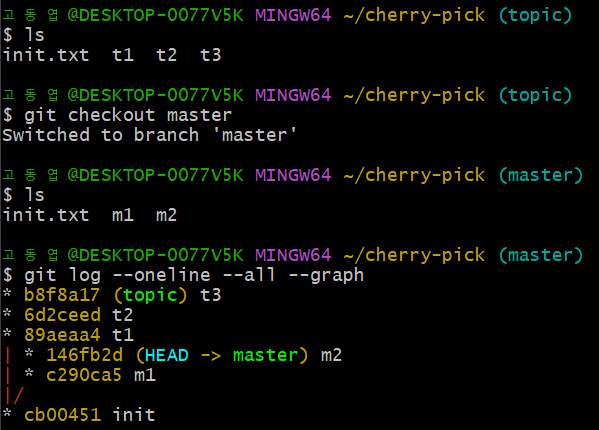
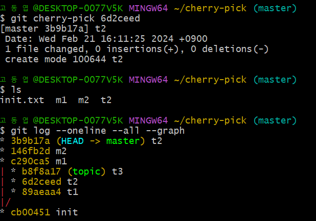
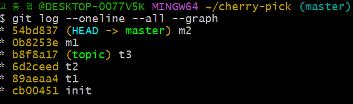
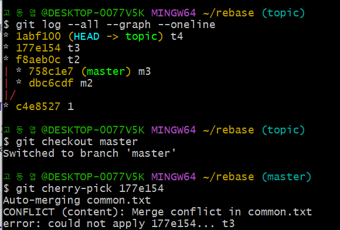
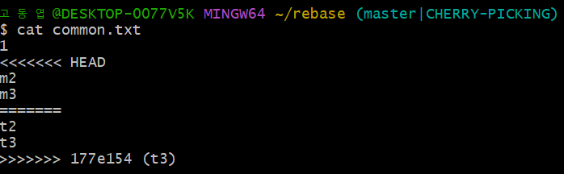
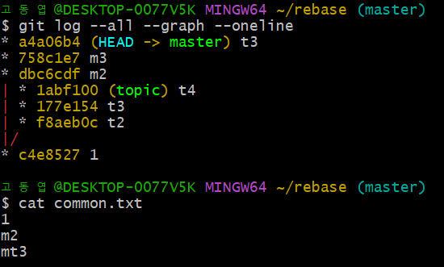
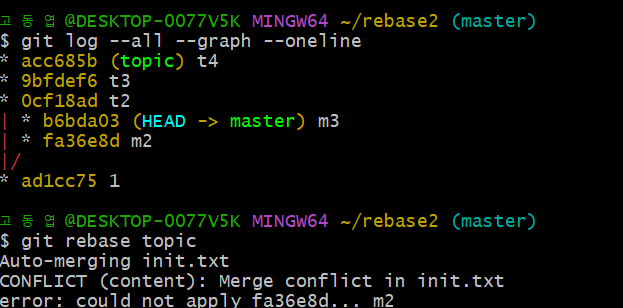
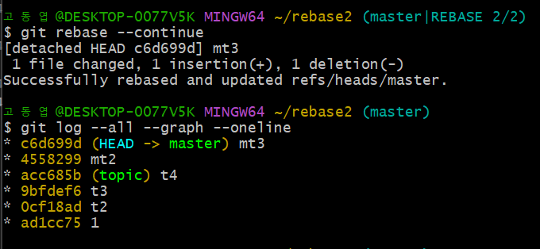

## GIT CLI -Cherry-pick & rebase  

* 기본 명령어  
    * ```touch [파일이름]``` : 해당 위치에 파일 생성  
    * ```rm [파일이름]``` : 해당 위치에 파일 삭제  

* cherry-pick  
    * ```g1it cherry-pick [가져오고 싶은 커밋 id 값]``` : 해당 버전이 생성될 
    변화를 가져와 새로운 버전을 만든다.  
    * 현재 상태  
      

    * cherry-pick 이후 상태, topic branch 파일인 t2가 master branch에 추가 됨을 확인할 수 있다!  
      

 * rebase
    
      
    
    * 위 상태에서 m1의 베이스를 t3로 바꾸고자 할때  ```git rebase [t3가 가르키는 branch name]``` 사용 -> 타임라인을 더 단순하게 바꾸어 줌  
      

    * rebase는 원격 저장소에 push하기 전에 사용해야 함  
    * merge를 사용하였을 경우와 반드시 같은 결과가 나와야 함  

* cherry-pick 충돌  
    * master branch에 t3버전일때의 변경사항을 cherry-pick하는데 충돌발생  
      

    * 수정사항이 겹쳐서 충돌이 발생 함을 git에서 알려줌  
      

    * 충돌이 일어난 부분을 수정한 이후에 ```git cherry-pick --continue```  
    * cherry-pick이 잘 실행되었고, 수정 사항이 잘 반영됨을 확인할 수 있음  
      

* rebase 충돌  
    * 'm2'의 base를 't4'로 변환하는 과정에서 충돌 발생  
      

    * 1. 먼저 "1"과 'm2' 사이에 변경 사항을 topic branch의 't4'와 비교하여 적용-> 충돌 발생 -> 충돌 부분 수정 -> ```gir rebase --continue``` ->  'mt2'버전 생성  
    * 2. 'm2'와 'm3'를 비교하여 변경 사항을 topic branch의 'mt2'와 비교하여 적용 -> 충돌 발생 -> 충돌 부분 수정 -> ```gir rebase --continue``` -> 'mt3'버전 생성  

    * 충돌이 발생했을 경우 mergetool을 이용하여 충돌이 일어난 부분의 내용을 수정하거나 직접 파일 내용을 수정한 이후 add를 해준다.  
    * [파일이름].orig 파일은 충돌이 일어난 부분을 수정하기 전 내용을 담고 있다.(```rm [파일이름].orig```를 통해 제거해도 상관없음)  
    * ```git log```를 통해 rebase 결과 확인  
    
