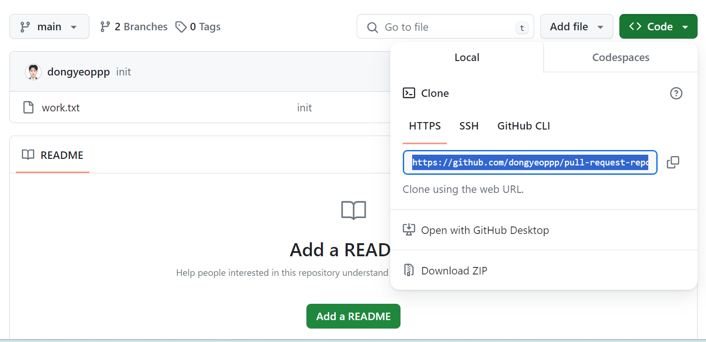
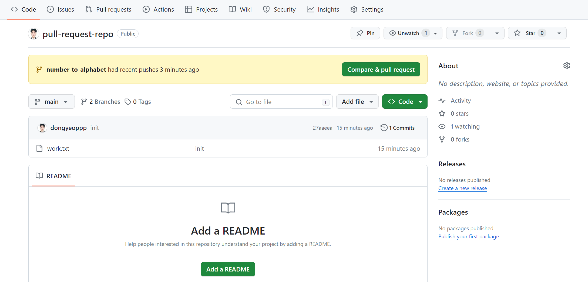
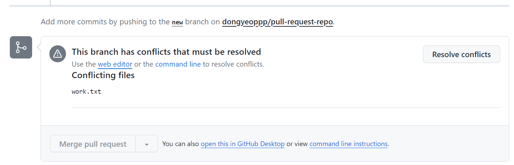
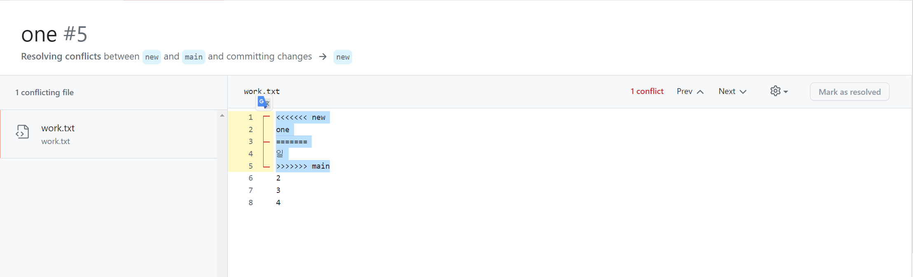
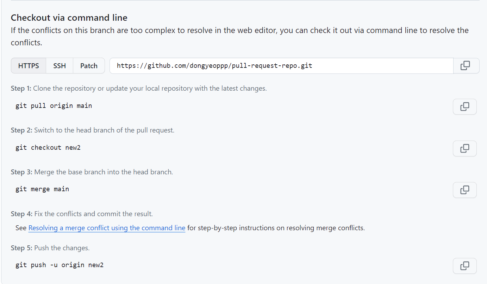
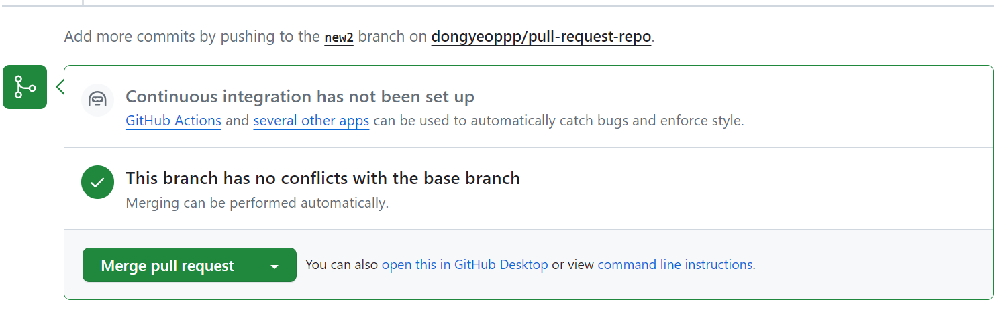
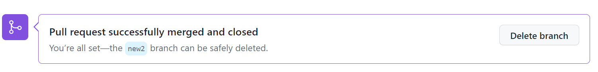

## GIT CLI - github.com Pull request  

* pull request : branch를 만들고 수정한 이후 병합을 요청하면 병합 권한이 있는 사람이 다른 branch로 병합해주게 함  
    * 기본 환경 세팅  
        * git hub 새로운 repository 생성 -> vs code 터미널에 ```git clone [web url(https)]```  
          

        * ```git add [파일 이름]``` -> ```git commit -m [커밋 메시지]``` -> ```git push orgin main``` 순서로 파일을 git hub에 업로드  

        * ```git checkout -b number-to-alphabet``` : 새로운 branch 만들고 해당 branch로 이동  -> 파일 수정 이후 커밋 -> git hub에 pull request 버튼이 생성  
         
        <br/><br/> 

    
    * 충돌 해결하기  
        * ```web editor``` or ```command line```을 활용하여 수정 가능  
        

        * web editor: 아래 부분 수정한 이후 ```commit merge```
              
        
        * command line  
              

            * 충돌한 부분을 수정하고 ```git push``` 이후엔 ```merge pull request``` 버튼 생성  
              

            * main branch에서 ```git merge [branch name]```을 하고 ```git push```를 하면 git hub에서 자동으로 pull request가 닫히는걸 확인할 수 있음   
            


