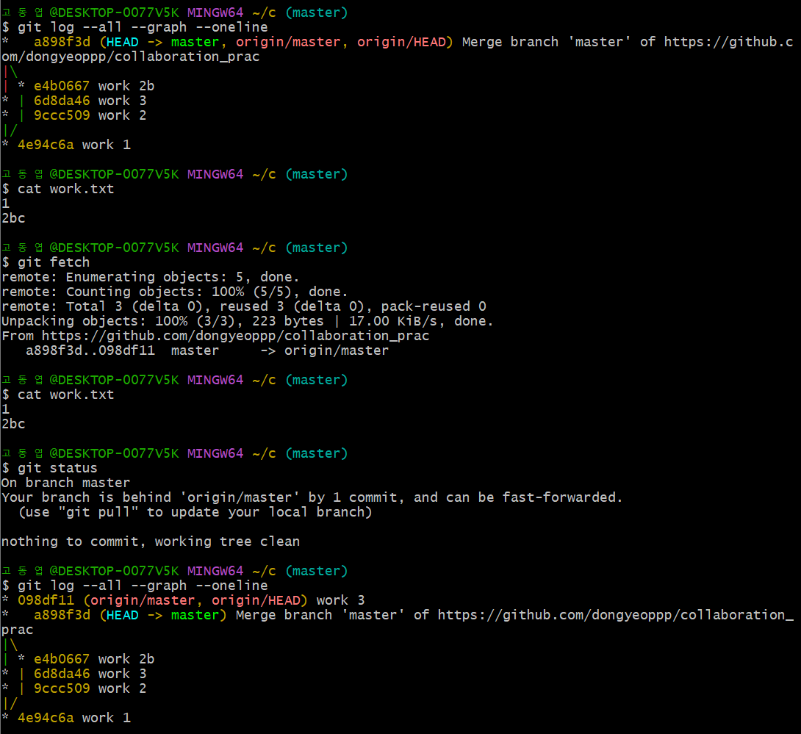
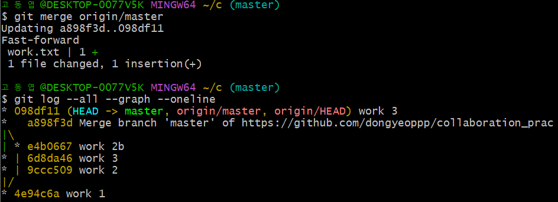

## GIT CLI - 협업

* 원격 브랜치와 FETCH  
    1. ```git pull``` -> ```git commit``` -> ```git push```
    2. ```git fetch``` -> ```git merge FETCH_HEAD``` -> ```git commit``` -> ```git push```  
    위의 1,2 경우를 비교해보자  

   * ```git fetch```를 했을 경우 원격저장소만 업데이트(파일의 내용은 바뀌지 않음)  
     

   * ```git merge origin/master``` 를 했을 경우 HEAD와 origin/master를 병합하여 파일이 업데이트 됨  
     

   * ```git pull``` = ```git fetch``` + ```git merge FETCH_HEAD```  
   (```git merge FETCH_HEAD```: 자동으로 가장 최근에 fetch했던 내용을 merge)  

   
