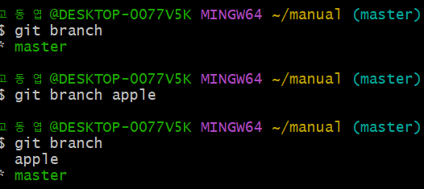
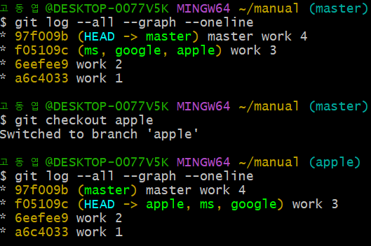
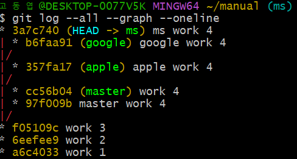
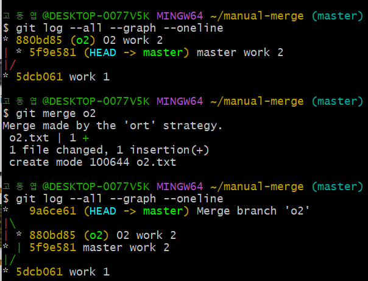
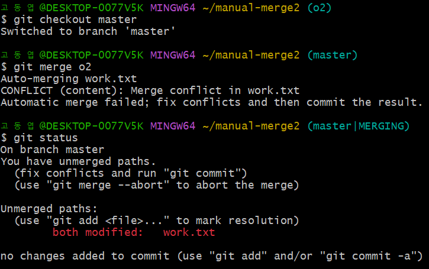
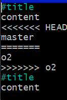

## GIT CLI - Branch & Conflict

* branch의 기본 사용  
    * ``` git branch ``` : 현재 branch의 목록 
    * ``` git branch (생성할 branch name) ``` : branch 생성
      
    * ``` git checkout (branch name) ``` : branch 전환(head의 위치가 변화)  
      
    * 하나의 저장소 안에서 공통의 작업을 공유하며 각자 자신의 작업을 가지고 있음을 확인  
      

* merge - 통합  
    * ``` git merge (통합하고 싶은 branch name) ``` : branch 통합하기  
    * merge - 두 branch의 파일 명이 다를 경우   
      
    * merge - 두 branch의 파일 명이 같을 경우 (다른 부분 병합)  
    -> 알아서 수정해 줌!
    *  merge - 두 branch의 파일 명과 수정한 부분이 같은 경우 -> conflict(충돌)  
        * master로 branch를 전환한 이후 통합-> 충돌이 난 것을 알림  
          ```git status```로 상태 확인  
          
        * 파일에서 중복된 부분 확인 후 수정하여 충돌 해결  
          

* checkout => HEAD를 제어  (change 기능)
* reset => branch를 제어  (delete 기능)


