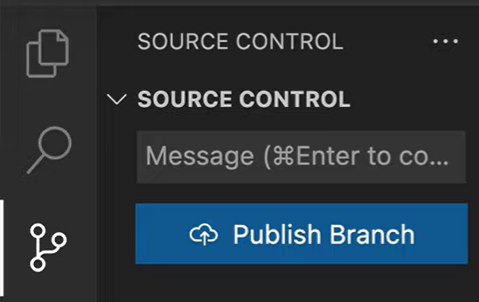
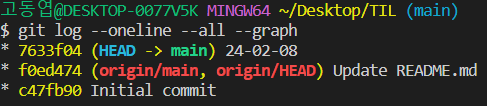

##  vscode에서 git으로 협업하기  

* commit 후 push 하기 
    * Source Control에서 message(git hub에서 last commit message로 보임) 입력 후 commit!  
    <br>  
    

    * ```git log --oneline --all --graph``` 터미널에 입력 -> commit이 잘 되었는지 확인  
    <br>  
    

    * push 이후  
    <br>  
    

* pull과 push 목록 확인 가능  
<br>  


* github에서 협업하기  
    * setting -> collaborators -> add people -> 사용자 이메일 입력 or username 입력  
    * 