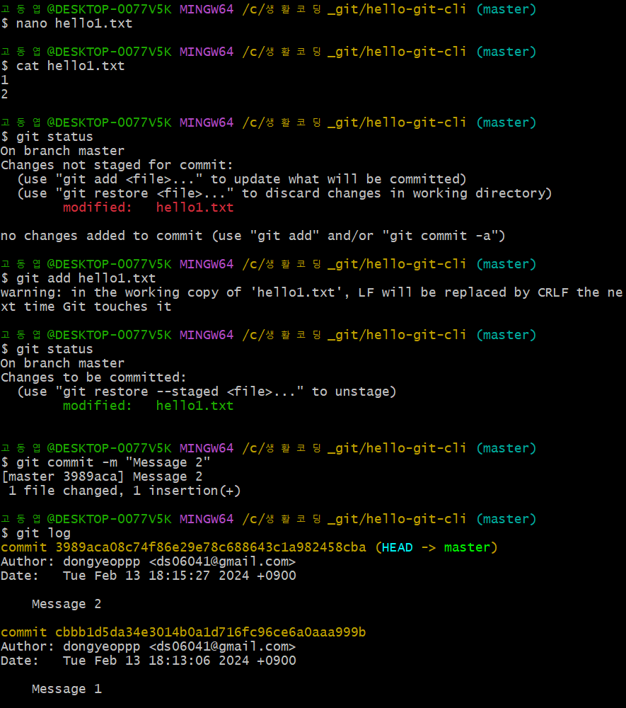
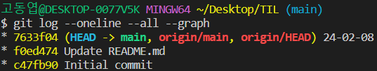

##  vscode에서 git으로 협업하기  

* commit 후 push 하기 
    * Source Control에서 message(git hub에서 last commit message로 보임) 입력 후 commit! 
      

    * ```git log --oneline --all --graph``` 터미널에 입력 -> commit이 잘 되었는지 확인  
    <br>
    

    * push 이후  
    <br>
    

* pull과 push 목록 확인 가능  
<br>
