## Docker  

* docker 설치  
    * docker.com -> developers -> documentation -> get docker -> 자신에게 맞는 운영체제 download  
    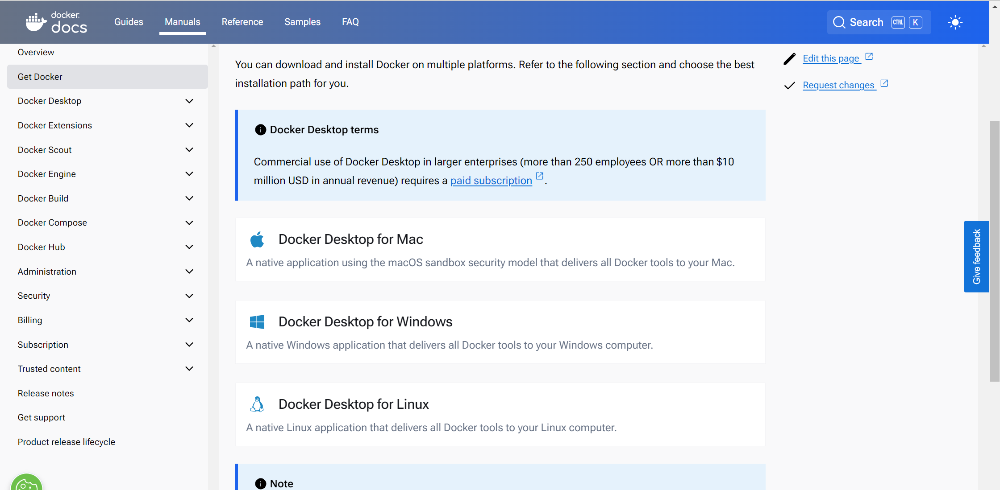  

    * docker dashboard  
    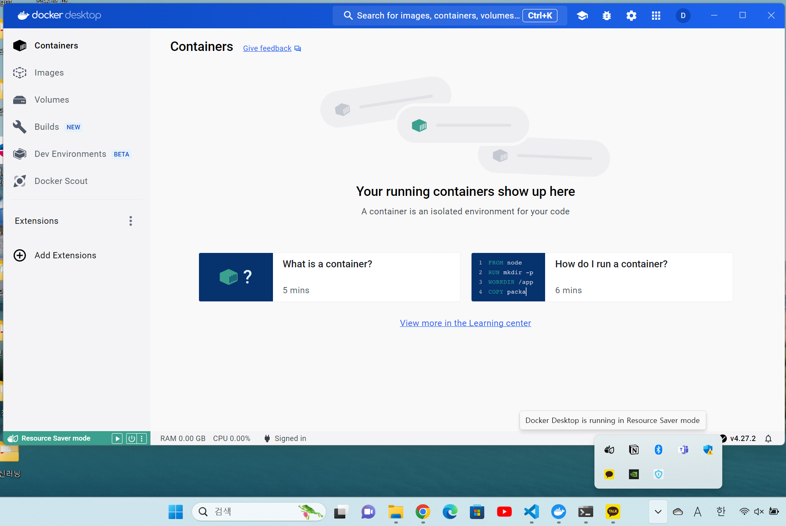  

* 이미지 pull  
    * hub.docker.com을 통해 이미지 찾은 후 command 입력  
    * [httpd] 이미지 pull  
        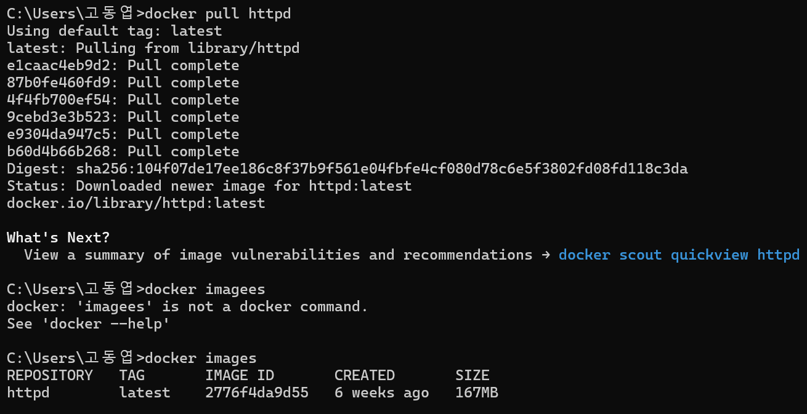  

    * ```docker pull [image name]```로 이미지 pull한 이후 ```docker images```로 확인  
    * docker dashboard에서도 확인 가능  
        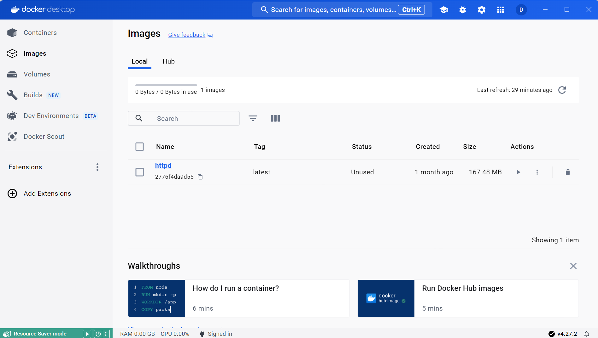  
    
* 컨테이너 run  
    ```docker run --name CNAME IMAGE``` : docker container 생성  
    ```docker ps``` : docker container 목록 확인  
    ```docker stop [container name 이나 id]``` : container 중지  
    ```docker ps -a``` :  stop된 container도 확인할 수 있음 (stop했다고 container가 삭제된 것이 아님)  
    ```docker start [container name 이나 id]``` : 중지되었던 container 다시 시작  
    ```docker logs [container name 이나 id]``` :  container log 출력  
    ```docker logs -f [container name 이나 id]``` : 실시간 log 확인  
    ```docker rm [container name 이나 id]``` : container 삭제(실행중인 container는 바로 삭제 불가, stop 이후에 rm)  
    ```docker rm --force [container name 이나 id]``` : stop하지 않고 바로 삭제 가능  
    ```docker rmi [IMAGE]``` : docker image 삭제  

* docker 네트워크  
    * docker dashboard에서 container 만들기  
        * 해당 image에서 run  
        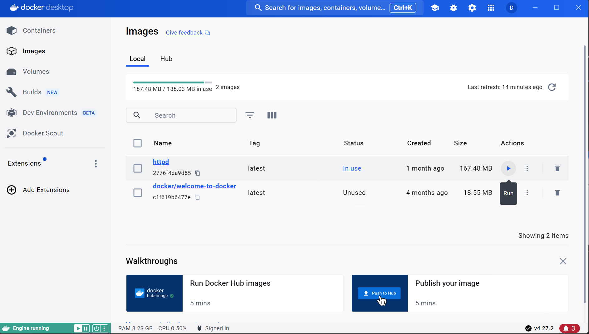  

        * container name, 포트 번호 설정 하고 run    
        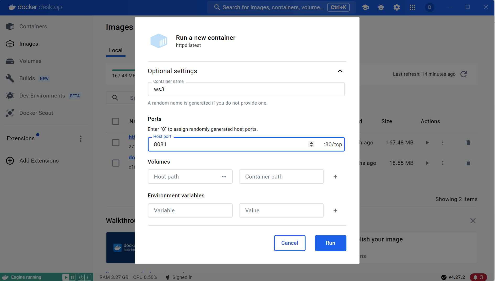   

        * 목록에서 확인 가능  
        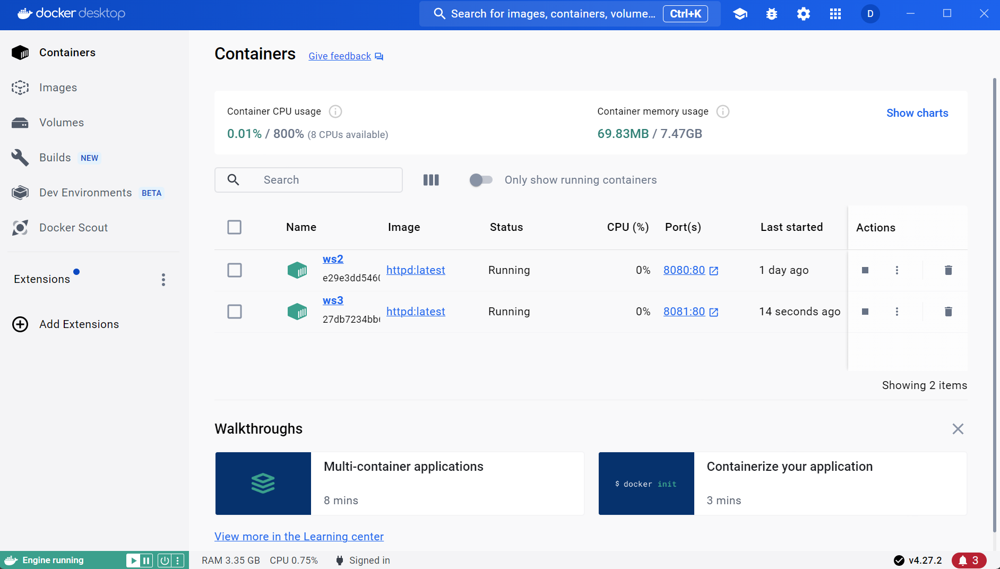  

    * command line으로 container 만들기  
        * ```docker run --name ws3 -p 8081:80 httpd``` : ws3을 이름으르 갖는 container 생성(포트 번호는 8081로 설정)  
        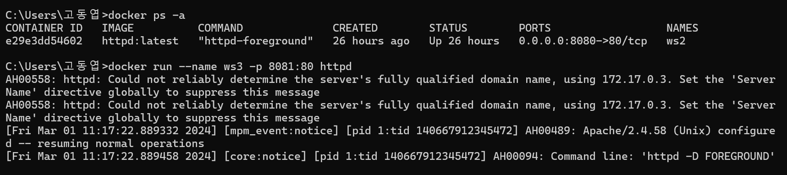  

        * 웹 host서버에서 잘 동작하는지 확인   
        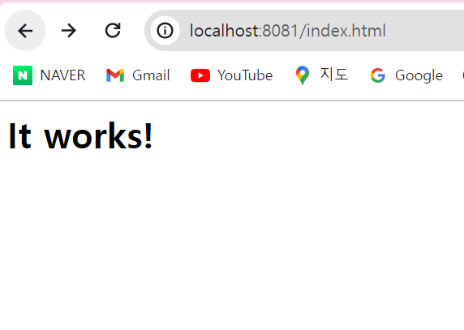  

* container 안에 파일 수정하기   
    * ```docker exec -it [COTAINER] bash(sh)```  : 해당 container 대상으로 명령하기  
    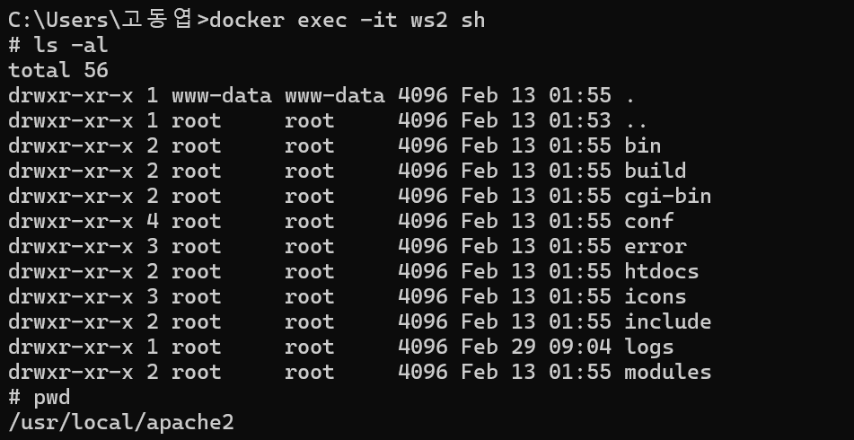  

    * index.html 파일 수정하기  
        * 해당 image에서 index.html 파일 경로를 복사  
        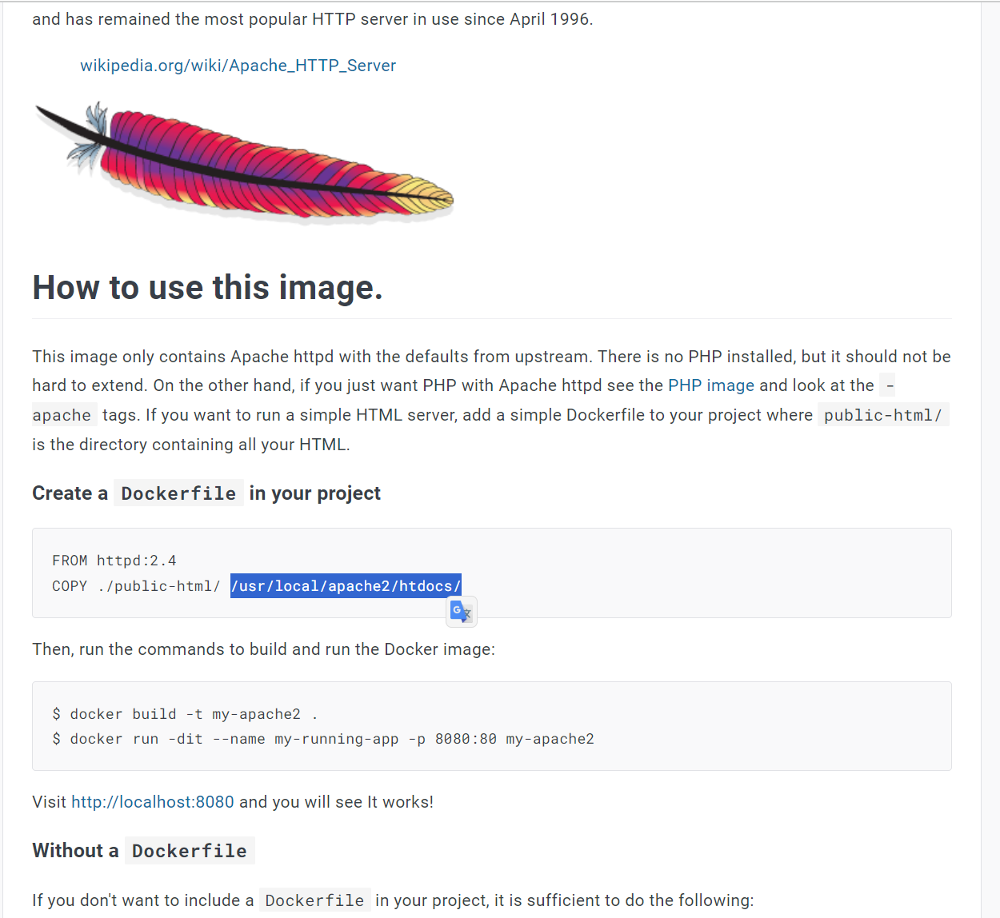

        * 해당 주소로 이동 (초기엔 nano와 같은 프로그램이 설치되어 있지 않아 설치 해주어야한다.)  
        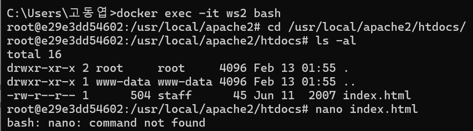  

        * ```apt update``` -> ```apt install nano``` -> ```nano index.html``` : nano 프로그램이 잘 실행 됨  
        * index.html 파일을 수정한 이후 웹에서 실행하여 변경된 내용이 잘 반영되는 것을 확인  
        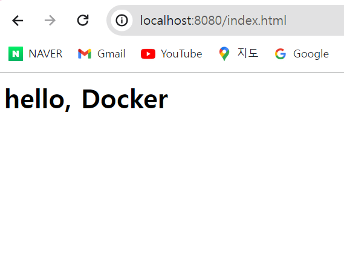  

    * 호스트와 컨테이너의 파일 시스템 연결하기  
        * c 드라이브 안에 폴더를 만들고 그 안에 index.html 파일을 연결 
        * ```docker run -p 8889:80 -v C:/Users/고동엽/Desktop/htdocs:/usr/local/apache2/htdocs httpd```  
        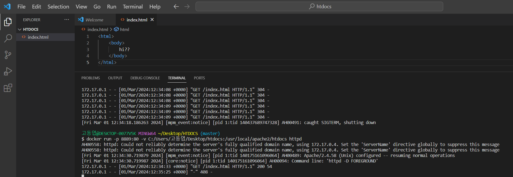  

        * 수정된 파일의 내용이 해당 로컬 포트 번호에서 실행됨을 확인  
          


